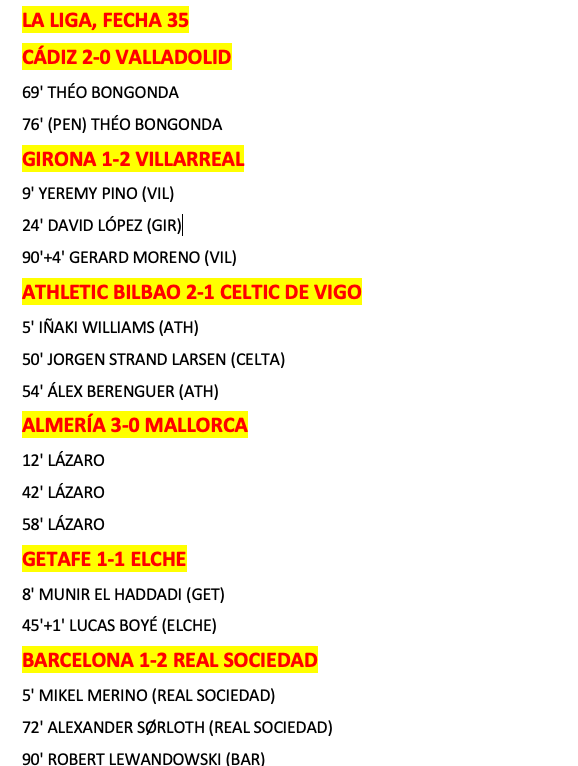
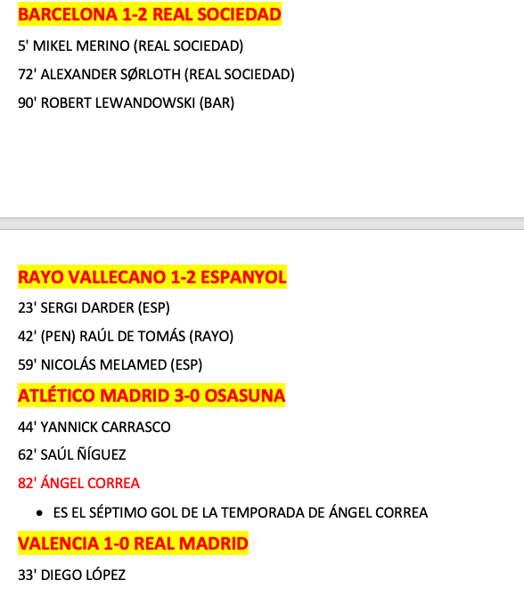

Soccer Scores Read ME

Opening the html web page of this project will allow you to run a program from your browser that
searches for soccer scores and displays it. 

Front End:
Welcome Page -> with button for new search
        Search Options:
                League (if left blank, will compute all scores for date range)
                Date Range (must be under a 1 week range)
Search Page -> Results of the search page -> will export as a CSV files
    includes:
            Date
            Team v What Team
            Score
            Name of the Person and time of the goal
            Assitance and Time

Example of what the output will look like:

Will use ESPN Soccer Scoreboard:
        https://www.espn.com/soccer/scoreboard/_/league/all/date/20230528
        